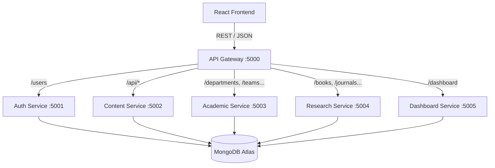
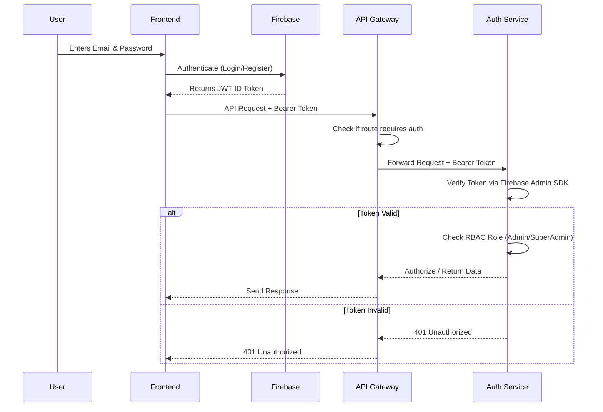

# Personal Lab (High Performance Computing-HPC) Management System

A scalable and role-based full-stack web application designed to streamline the management of academic research lab activities, publications, supervision records, research teams, and member administration.

The platform provides a centralized digital ecosystem where professors, researchers, students, and administrators can efficiently manage and showcase research-related information through a modern, secure, and responsive web interface.

---

## 🌐 Live Application

[](https://high-performance-computing-lab-2vkn.vercel.app)

---

# Project Overview

The **Personal Lab (HPC) Management System** was developed to solve the limitations of manually maintained or static lab websites commonly used in academic environments.

Traditional research lab websites often suffer from:

* Difficult content management
* Outdated information
* Lack of centralized administration
* Poor scalability
* Weak access control
* Inefficient publication management

To overcome these challenges, this system introduces a dynamic and scalable architecture that supports:

* Real-time data management
* Role-based administration
* Secure authentication
* Research publication management
* Thesis and project supervision tracking
* Student and alumni management
* Interactive lab presentation

The system is designed with modular architecture principles to ensure maintainability, scalability, and future extensibility. It has been recently upgraded from a monolithic backend to a robust **Microservices Architecture**.

---

# Key Features

## Core Functionalities

* Full Stack MERN-Based Architecture (Microservices)
* Role-Based Access Control (RBAC)
* JWT Authentication & Authorization
* Secure Password Encryption (bcrypt)
* Dynamic CRUD Operations
* Real-Time Data Synchronization
* Responsive User Interface
* Research Department & Team Management
* Academic Publication Management
* Thesis & Project Supervision Tracking
* Student & Alumni Management
* Administrative Dashboard
* Super Admin Role Management
* Scalable Modular Structure
* Optimized Database Operations
* API Gateway integration

---

# User Roles & Permissions

The platform provides three different access levels to ensure secure and structured management of lab resources.

---

## Viewer / Public User

General visitors can explore all publicly available lab information without authentication.

### Viewer Capabilities

* Browse research departments
* Explore research teams
* View journals, conferences, and books
* Access current and completed projects/thesis
* Explore student and alumni profiles
* View lab statistics and achievements
* Access lab contact information
* Read detailed research information

---

## Admin

Admins are responsible for managing all lab-related operational content.

### Admin Capabilities

### Research Management

* Create, update, and delete research departments
* Manage research teams
* Maintain department details and documentation

### Publication Management

* Manage journal publications
* Manage conference publications
* Manage books and academic resources

### Supervision Management

* Manage current thesis records
* Manage completed thesis records
* Manage current projects
* Manage completed projects
* Update project/thesis status dynamically

### Member Management

* Manage student profiles
* Maintain alumni records
* Update member information

### Website Content Management

* Manage homepage content
* Update lab information
* Manage contact details
* Manage footer information
* Upload and update images

### System Features

* Real-time content updates
* Dynamic CRUD operations
* Secure admin panel access

---

## Super Admin

Super Admin has complete authority over the entire system infrastructure and administrative governance.

### Super Admin Capabilities

* All Admin Functionalities
* Create Admin Accounts
* Delete Admin Accounts
* Promote/Demote User Roles
* Manage Super Admin Accounts
* Control Administrative Permissions
* Full System Governance & Monitoring

---

# Technology Stack

## Frontend Technologies

| Technology   | Purpose                    |
| ------------ | -------------------------- |
| React.js     | Interactive UI Development |
| Tailwind CSS | Responsive Styling         |
| JavaScript   | Client-Side Logic          |
| HTML5        | Structure & Markup         |
| CSS3         | Styling & Layout           |

---

## Backend Technologies (Microservices)

| Technology | Purpose                        |
| ---------- | ------------------------------ |
| Node.js    | Server-Side Runtime            |
| Express.js | Microservices & API Gateway    |
| MongoDB    | NoSQL Database                 |
| Docker     | Containerization               |
| JWT        | Authentication & Authorization |
| bcrypt     | Password Security              |

---

## Development Tools

* Visual Studio Code
* Docker & Docker Compose
* Git & GitHub
* Postman
* MongoDB Atlas

---

# System Architecture

The project has evolved into a modern multi-tier **Microservices architecture** for scalability, fault tolerance, and independent deployability.

## Microservices Architecture Diagram



## Microservice Responsibilities

- **API Gateway (`api-gateway`)**: Acts as the single entry point for the frontend. Handles request routing, CORS, and basic token presence checks.
- **Auth Service (`auth-service`)**: Manages user authentication, Firebase JWT verification, role management (User/Admin/SuperAdmin), and user profiles.
- **Content Service (`content-service`)**: Manages dynamic website content including homepage banners, about pages, contact info, footer, and image uploads.
- **Academic Service (`academic-service`)**: Handles core academic domain logic including department details, research teams, and academic project/thesis supervisions.
- **Research Service (`research-service`)**: Manages all lab publications, including journal articles, conference papers, and book chapters.
- **Dashboard Service (`dashboard-service`)**: Aggregates cross-service statistics and metrics to power the administrative dashboard.

## Frontend Layer

Handles user interaction and responsive UI rendering using React.js.

## Backend Layer (Microservices)

Provides RESTful APIs, authentication, authorization, and business logic using an API Gateway routing to independent Node.js microservices. The services include:
* **API Gateway** (Port 5000)
* **Auth Service** (Port 5001)
* **Content Service** (Port 5002)
* **Academic Service** (Port 5003)
* **Research Service** (Port 5004)
* **Dashboard Service** (Port 5005)

*(Note: The legacy monolithic backend is also preserved in the repository.)*

## Database Layer

Stores structured lab and user-related information using MongoDB.

---

# Installation Guide

## Prerequisites

Before running the project locally, make sure you have:

* Node.js 14 or later
* npm or yarn
* Docker and Docker Compose
* MongoDB Atlas account or local MongoDB instance
* Firebase project
* Cloudinary account

## Setup Steps

1. Clone the repository.

```bash
git clone YOUR_GITHUB_REPOSITORY_LINK
cd YOUR_PROJECT_FOLDER
```

2. Create the frontend environment file.

Create a `.env` file inside `frontend/Research_lab` or modify `.env.local`:

```env
VITE_backend_url=http://localhost:5000
VITE_apiKey=YOUR_FIREBASE_API_KEY
VITE_authDomain=YOUR_FIREBASE_AUTH_DOMAIN
VITE_projectId=YOUR_FIREBASE_PROJECT_ID
VITE_storageBucket=YOUR_FIREBASE_STORAGE_BUCKET
VITE_messagingSenderId=YOUR_FIREBASE_MESSAGING_SENDER_ID
VITE_appId=YOUR_FIREBASE_APP_ID
```

3. Configure Environment Variables for Microservices.

Each microservice requires its own environment configuration. You can use a shared `.env` in the root (for `docker-compose.yml`) or individual `.env` files in each service directory (e.g., `services/api-gateway/.env`).

**Example backend variables (`.env`):**
```env
# Database
MONGO_URI=your_mongodb_atlas_connection_string

# API Gateway Configuration
FRONTEND_URL=http://localhost:5173
PORT=5000
AUTH_SERVICE_URL=http://auth-service:5001
CONTENT_SERVICE_URL=http://content-service:5002
ACADEMIC_SERVICE_URL=http://academic-service:5003
RESEARCH_SERVICE_URL=http://research-service:5004
DASHBOARD_SERVICE_URL=http://dashboard-service:5005

# Firebase & Cloudinary configs
FB_SERVICE_KEY=YOUR_BASE64_ENCODED_FIREBASE_SERVICE_ACCOUNT
CLOUDINARY_CLOUD_NAME=YOUR_CLOUDINARY_CLOUD_NAME
CLOUDINARY_API_KEY=YOUR_CLOUDINARY_API_KEY
CLOUDINARY_API_SECRET=YOUR_CLOUDINARY_API_SECRET
```

## How to Run (Microservices with Docker)

The recommended way to run the entire stack (Microservices + Frontend) is via Docker Compose.

```bash
# Build and run all containers
docker-compose up --build -d
```

**What this does:**
1. Builds individual Docker images for the frontend and all backend microservices.
2. Provisions an isolated Docker network (`hpc-network`).
3. Maps internal container ports to your localhost for easy access.

**Access Points:**
- **Frontend App**: [http://localhost:5173](http://localhost:5173)
- **API Gateway**: [http://localhost:5000](http://localhost:5000) (All frontend requests go here)
- **Individual Services**: Accessible on ports `5001` - `5005` for direct debugging.

**Helpful Docker Commands:**
```bash
# View logs for all services
docker-compose logs -f

# Stop all services
docker-compose down

# Rebuild a specific service after code changes
docker-compose up -d --build api-gateway
```

*(Note: Ensure your frontend `VITE_backend_url` is pointed to the API Gateway at `http://localhost:5000`)*

## Running the Legacy Monolith

If you need to run the old monolith instead:

```bash
cd backend
npm install
npm run dev
```
(Starts on port 2500. You will need to change your frontend `.env` to point to port 2500).

---

# Folder Structure

```text
HPC-Lab/
├── services/
│   ├── api-gateway/          ← :5000 (public-facing)
│   │   ├── src/
│   │   │   ├── index.js
│   │   │   ├── proxy.js
│   │   │   ├── authMiddleware.js
│   │   │   ├── routeConfig.js
│   │   │   └── middleware/
│   │   │       ├── requestId.js
│   │   │       ├── headerSanitizer.js
│   │   │       └── errorHandler.js
│   │   ├── package.json
│   │   └── Dockerfile
│   │
│   ├── auth-service/         ← :5001
│   │   ├── src/
│   │   │   ├── index.js
│   │   │   ├── config/
│   │   │   │   ├── db.js
│   │   │   │   └── firebase.js
│   │   │   ├── models/
│   │   │   │   └── userModel.js
│   │   │   ├── controllers/
│   │   │   │   └── userController.js
│   │   │   ├── routes/
│   │   │   │   ├── userRoutes.js
│   │   │   │   └── internalRoutes.js
│   │   │   └── middleware/
│   │   │       ├── verifyFBToken.js
│   │   │       ├── verifyAdmin.js
│   │   │       ├── verifySuperadmin.js
│   │   │       └── internalAuth.js
│   │   ├── package.json
│   │   └── Dockerfile
│   │
│   ├── content-service/      ← :5002
│   │   ├── src/
│   │   │   ├── index.js
│   │   │   ├── config/
│   │   │   │   ├── db.js
│   │   │   │   └── cloudinary.js
│   │   │   ├── models/
│   │   │   │   ├── homeModel.js
│   │   │   │   ├── aboutLabModel.js
│   │   │   │   ├── aboutProfModel.js
│   │   │   │   ├── contactModel.js
│   │   │   │   ├── footerModel.js
│   │   │   │   └── imageModel.js
│   │   │   ├── controllers/
│   │   │   │   ├── homeController.js
│   │   │   │   ├── aboutLabController.js
│   │   │   │   ├── aboutProfController.js
│   │   │   │   ├── contactController.js
│   │   │   │   ├── footerController.js
│   │   │   │   └── imageController.js
│   │   │   ├── routes/
│   │   │   │   ├── homeRoutes.js
│   │   │   │   ├── aboutLabRoutes.js
│   │   │   │   ├── aboutProfRoutes.js
│   │   │   │   ├── contactRoutes.js
│   │   │   │   ├── footerRoutes.js
│   │   │   │   ├── imageRoutes.js
│   │   │   │   └── internalRoutes.js
│   │   │   └── middleware/
│   │   │       └── internalAuth.js
│   │   ├── package.json
│   │   └── Dockerfile
│   │
│   ├── academic-service/     ← :5003
│   │   ├── src/
│   │   │   ├── index.js
│   │   │   ├── config/
│   │   │   │   └── db.js
│   │   │   ├── models/
│   │   │   │   ├── departmentModel.js
│   │   │   │   ├── studentProjectModel.js
│   │   │   │   └── otherCountryProjectModel.js
│   │   │   ├── controllers/
│   │   │   │   ├── departmentController.js
│   │   │   │   ├── teamController.js
│   │   │   │   └── studentProjectController.js
│   │   │   ├── routes/
│   │   │   │   ├── departmentRoutes.js
│   │   │   │   ├── teamRoutes.js
│   │   │   │   ├── studentProjectRoutes.js
│   │   │   │   └── internalRoutes.js
│   │   │   └── middleware/
│   │   │       └── internalAuth.js
│   │   ├── package.json
│   │   └── Dockerfile
│   │
│   ├── research-service/     ← :5004
│   │   ├── src/
│   │   │   ├── index.js
│   │   │   ├── config/
│   │   │   │   └── db.js
│   │   │   ├── models/
│   │   │   │   ├── journalModel.js
│   │   │   │   ├── conferenceModel.js
│   │   │   │   └── bookModel.js
│   │   │   ├── controllers/
│   │   │   │   ├── journalController.js
│   │   │   │   ├── conferenceController.js
│   │   │   │   └── bookController.js
│   │   │   ├── routes/
│   │   │   │   ├── journalRoutes.js
│   │   │   │   ├── conferenceRoutes.js
│   │   │   │   ├── bookRoutes.js
│   │   │   │   └── internalRoutes.js
│   │   │   └── middleware/
│   │   │       └── internalAuth.js
│   │   ├── package.json
│   │   └── Dockerfile
│   │
│   └── dashboard-service/    ← :5005
│       ├── src/
│       │   ├── index.js
│       │   ├── controllers/
│       │   │   └── dashboardController.js
│       │   ├── routes/
│       │   │   └── dashboardRoutes.js
│       │   └── middleware/
│       │       └── internalAuth.js
│       ├── package.json
│       └── Dockerfile
│
├── docker-compose.yml        ← New multi-service compose
├── .env                      ← Shared env variables
├── backend/                  ← Original monolith (preserved)
├── frontend/
│   └── Research_lab/
│       ├── public/
│       │   └── assetss/
│       ├── src/
│       │   ├── AdminPages/
│       │   ├── Components/
│       │   ├── Firebase/
│       │   ├── hooks/
│       │   ├── Layouts/
│       │   ├── Pages/
│       │   ├── Provider/
│       │   ├── Router/
│       │   ├── Routes/
│       │   ├── Utility/
│       │   ├── App.jsx
│       │   ├── App.css
│       │   ├── index.css
│       │   ├── main.jsx
│       │   └── utils.jsx
│       ├── index.html
│       ├── package.json
│       ├── tailwind.config.js
│       ├── postcss.config.js
│       ├── vite.config.js
│       └── vercel.json
│
└── README.md
```

---

# Security Features

* JWT-Based Authentication
* Role-Based Authorization
* Protected API Routes via Gateway
* Password Hashing using bcrypt
* Secure User Session Handling
* Access Restriction for Administrative Routes

---

# Real-Time Functionalities

* Dynamic Data Synchronization
* Instant Frontend Updates
* Real-Time CRUD Operations
* Live Content Rendering
* Efficient State Management

---

# System Modules

The platform is divided into multiple independent and scalable modules to ensure maintainability, flexibility, and efficient management of academic lab resources.

---

## Home Module

The homepage acts as the central landing interface of the platform and provides summarized lab information.

### Functionalities

* Dynamic Welcome Banner
* Research lab Introduction
* lab Statistics & Achievements
* Featured Research Areas
* Publication Highlights
* Awards & Recognition Section
* Responsive Hero Section

---

## About Module

The About module provides comprehensive information regarding the lab and its academic vision.

### Functionalities

* lab Overview
* Mission & Vision
* Research Interests
* Professor Information
* Deputy Lab Head Information
* Academic Background Presentation

---

## Research Module

The Research module manages all departmental and research team related information.

### Department Management

* Create Departments
* Update Department Information
* Delete Departments
* Department Detail Pages
* Department Documentation Support

### Team Management

* Create Research Teams
* Maintain Team Profiles
* Define Research Areas
* Team Vision & Mission
* Research Methodologies
* Funding & Academic Impact Information

---

## Publications Module

The Publications module centralizes all academic publication records.

### Supported Publication Types

* Journals
* Conferences
* Books

### Functionalities

* Add Publications
* Update Publications
* Delete Publications
* External Publication Links
* Publication Metadata Management
* Categorized Publication Display

---

## Supervisions Module

This module manages academic projects and thesis supervision records.

### Thesis Management

* Current Thesis Tracking
* Completed Thesis Management
* Thesis Status Control
* Student Information Management

### Project Management

* Current Project Tracking
* Completed Project Records
* Project Lifecycle Management
* Project Documentation Support

---

## Members Module

The Members module organizes student and alumni information.

### Supported Categories

* BSc Students
* MSc Students
* PhD Students
* Alumni

### Functionalities

* Student Profile Management
* Alumni Record Management
* Academic Information Display
* Project/Thesis Association
* Current ↔ Alumni Status Transition

---

## Contact Module

This module manages official communication and lab contact information.

### Functionalities

* lab Contact Information
* Office Address Management
* Email & Social Links
* Professor Contact Profiles
* Institutional References

---

# Authentication & Authorization

The system implements modern authentication and authorization mechanisms to ensure secure access control and protected administrative operations.

## Authentication Flow Diagram



## Authentication Features

* JWT-Based Authentication
* Secure Login System
* Protected User Sessions
* Token Verification
* Persistent Authentication

## Authorization Features

* Role-Based Access Control (RBAC)
* Protected Administrative Routes
* Permission-Based Operations
* Secure Resource Access

---

# Database Design & Management

The platform uses MongoDB as the primary database system for handling structured and semi-structured lab data efficiently.

## Database Features

* Scalable NoSQL Architecture
* Optimized Query Operations
* Structured Research Data Management
* Efficient Relationship Handling
* Dynamic Content Storage
* Secure User Data Management

---

# Real-Time Functionalities

The platform supports dynamic real-time interactions between the frontend and backend systems.

## Real-Time Features

* Dynamic Data Synchronization
* Instant CRUD Updates
* Automatic Frontend Rendering
* Live Content Modification
* Efficient State Management
* Optimized API Communication

---

# API & Backend Functionalities

The backend architecture is designed using RESTful API principles via Microservices.

## Backend Features

* REST API Architecture
* Centralized API Gateway
* Independent Microservices
* Secure Route Handling
* Middleware-Based Authorization
* Error Handling System
* Request Validation

---

# Responsive Design

The entire system is optimized for multiple screen sizes and modern devices.

## Responsive Features

* Mobile-Friendly Layout
* Tablet Compatibility
* Desktop Optimization
* Responsive Navigation
* Adaptive UI Components

---

# Screenshots

# Home Page

## Welcome Section


*The dynamic welcome banner displaying the lab's main theme and initial introduction.*

---

## About Section


*An overview of the lab's mission, vision, and core values.*

---

## lab Statistics


*A quick numerical snapshot of the lab's achievements, publications, and members.*

---

## Research Department Section


*Displays the various research departments currently active within the HPC lab.*

---

## Publication Highlight Section


*Highlights the recent and notable research publications from the lab.*

---

## Awards & Achievements Section


*Showcases the diverse awards, honors, and recognition received by the lab.*

---


# About Page


*Comprehensive details regarding the lab, including its professors and main focus areas.*

---

# Research Module

## Research Departments


*Detailed view of the different departments driving the core research initiatives.*

---

## Department Details


*In-depth information and documentation for a specific research department.*

---

## Research Teams


*Overview of the specialized research teams collaborating within the lab.*

---

## Team Details


*Provides a closer look into a specific research team, their vision, and methodologies.*

---


# Publications Module

# Journal Publications


*A structured list displaying all journal publications published by the lab members.*

# Conference Paper


*Highlights the conference papers and presentations delivered at various academic events.*

# Book Chapter


*Showcases book chapters and related academic resources authored by the team.*

# Supervisions Module

## Current Thesis


*A dashboard tracking the ongoing thesis supervisions for current students.*

---

## Completed Thesis


*Archive of all successfully completed thesis works with their respective details.*

---

## Current Projects


*Monitor the active academic projects currently being undertaken in the lab.*

---

## Completed Projects


*Record of all finalized academic projects and their lifecycle outcomes.*

---

# Members Module

## Current Students


*Profiles of the currently active BSc, MSc, and PhD students in the lab.*

---

## Alumni Members


*A directory of former lab members and their academic or professional transitions.*

---

# Contact Module


*Official contact information, office address, and social links to get in touch with the lab.*

---

# Authentication Interfaces

## Registration Interface


*A secure user registration form for onboarding new members to the platform.*

---

## Login Interface


*The secure login portal for administrators and members to access the dashboard.*

---

# Administrative Dashboard

## Dashboard Overview


*A centralized administrative dashboard providing a quick summary of lab statistics.*

---

## Home Management


*Admin interface for managing homepage content such as statistics and awards.*

---

## Image Management


*Admin section for uploading and updating images featured on the main website.*

---

## Department Management


*Allows admins to create, update, or remove research department information.*

---

## Team Management


*Interface for managing research teams, their details, and focus areas.*

---

## Journal Management


*Admin portal for adding, updating, and categorizing new journal publications.*

---

## Conference Management


*Manage and update conference publications efficiently through this interface.*

---

## Book Management


*Controls the details and listings of academic books and book chapters.*

---

## Student & Member Management


*An interface to manage student profiles, track their current standing, and update alumni records.*

---

## Contact Information Management


*Admin panel to easily update lab contact details and office information.*

---

# Super Admin Dashboard


*Exclusive dashboard for the Super Admin to govern the entire system and manage admin roles.*

---

# Future Enhancements

The platform is designed with scalability in mind and can be extended with advanced functionalities in future releases.

## Planned Improvements

* Advanced Search & Filtering System
* Cloud Deployment & Scalability
* Two-Factor Authentication (2FA)
* Advanced Analytics Dashboard
* Automated Notification System
* Research Collaboration Features
* Mobile Application Support
* Report Generation System
* AI-Based Recommendation Features

---

# Conclusion

The Personal Lab (High Performance Computing-HPC) Management System successfully delivers a centralized, scalable, and secure solution for managing academic lab activities and research resources.

The platform enhances:

* Research visibility
* Administrative efficiency
* Student and researcher collaboration
* Academic publication management
* Secure lab administration

By integrating modern web technologies with role-based management architecture, the system provides a robust digital infrastructure suitable for modern academic and research environments.
